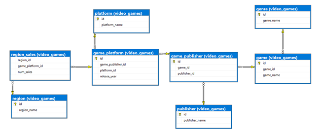
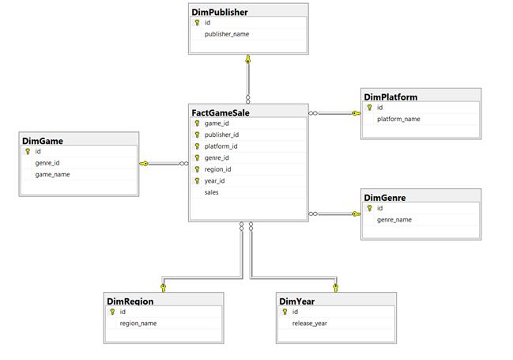
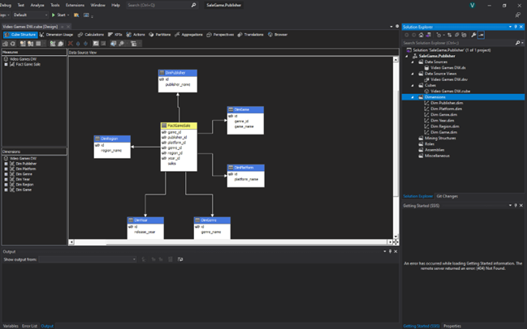
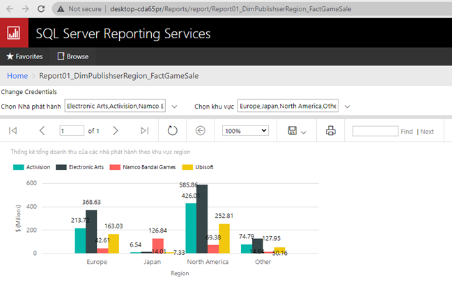

# Game Sales Data Warehouse

## Table of Contents
* [About The Project](#about-the-project)
* [Technologies Used](#technologies-used)
* [Setup and Launch](#setup-and-launch)
* [Project Status](#project-status)
* [Contact](#contact)
<!-- * [License](#license) -->

## About The Project
- Build a Star Schema Data Warehouse model with Dim tables (containing the objects to be analyzed) and Fact table (containing the ids of the objects and 1 column containing the values grouped by from the ids)

## Technologies Used
- SQL Server 2019
- Visual Studio 2019
- [SQL Server Integration Services Projects](https://marketplace.visualstudio.com/items?itemName=SSIS.SqlServerIntegrationServicesProjects) 4.2
- [Microsoft Analysis Services Projects](https://marketplace.visualstudio.com/items?itemName=ProBITools.MicrosoftAnalysisServicesModelingProjects) 2.9.18
- [Microsoft Reporting Services Projects](https://marketplace.visualstudio.com/items?itemName=ProBITools.MicrosoftReportProjectsforVisualStudio) 2.6.11

## Setup and Launch
1. Restore "./Database/55N1NguyenVuGameSale.bak" and "./Database55N1NguyenVuGameSale_DW.bak"

Product Database:

Data Warehouse:

2. Run "./55.N1.01.NguyenTuanVu.GameSale.DWH/55N1NguyenVuGameSale_DWH.sln" to see Data Warehouse

3. Run "./55.N1.01.NguyenTuanVu.GameSale.DWH/55N1NguyenVuGameSale_DWH_SSRS.sln" to see Report

## Project Status
Project is: _complete_

## Contact
- [Vũ Nguyễn](https://github.com/vunguyen22271)
